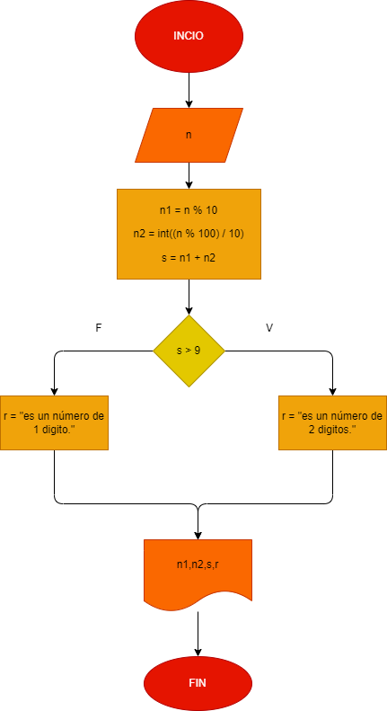

# Taller  ejercicio No.6: Construir un programa que lea un número entero y que determine si el resultado de sumar sus dos últimos dígitos es un número de 1 dígito.

##
Analisis
n1 = n % 10
n2 = int((n % 100) / 10)
s = n1 + n2

## Diagrama de flujo

