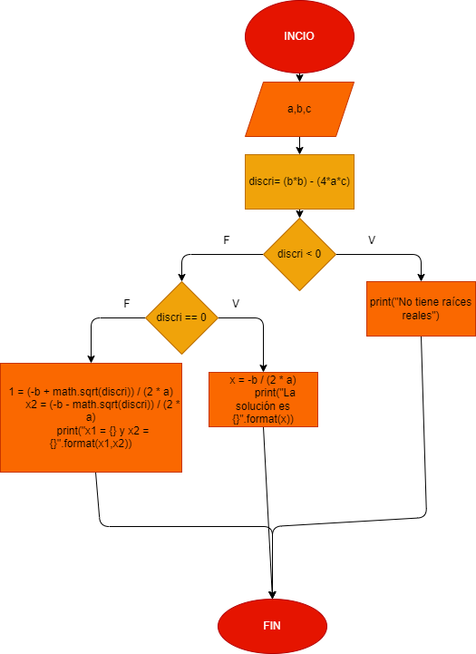

# Taller Ejercicio No. 8: Ecuación de segundo grado

## Diagrama de flujo

# Analisis
ax²+bx+c=0
b±√(b²-4ac))/(2a)
Discriminante:
disc < 0 = no tiene solución
disc == 0 = una solución
disc > 0 = dos soluciones

